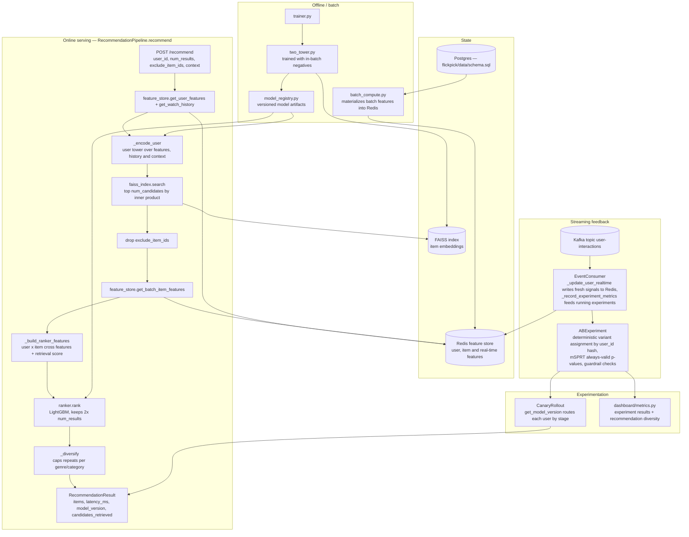
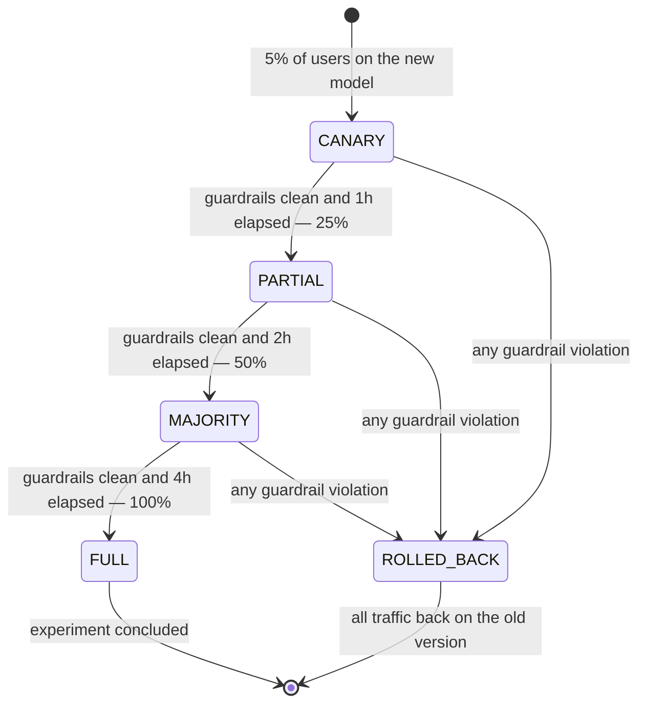

# Flickpick — Personalized Recommendation Engine with Online Learning

Two-tower neural retrieval + LightGBM ranking, served in real time. FAISS ANN candidate generation, Redis online feature store, Kafka implicit-feedback streams, A/B experimentation with always-valid p-values, and canary rollout with auto-rollback on metric regression.

## Architecture



Canary rollout is a state machine over traffic share, with a guardrail check on every advance:



## What it is

- **Retrieval** (`flickpick/models/two_tower.py`): two-tower (user, item) encoder trained with in-batch negatives.
- **Ranking** (`flickpick/models/ranker.py`): LightGBM pairwise ranker on retrieved candidates.
- **Serving** (`flickpick/serving/`): FAISS index, model registry, end-to-end recommendation pipeline.
- **Features** (`flickpick/features/`): batch + real-time feature store backed by Redis.
- **Data** (`flickpick/data/`): Postgres schema, Kafka event consumer, synthetic generator for local dev.
- **Experiment** (`flickpick/experiment/`): A/B framework with sequential testing (always-valid p-values), canary rollout, auto-rollback hooks.
- **Dashboard** (`flickpick/dashboard/metrics.py`): backend metrics for the React analytics dashboard (experiment results, recommendation diversity).
- **API** (`flickpick/api/app.py`): FastAPI service, exposed on `:8000`.

Tech: Python 3.12, PyTorch, LightGBM, FAISS, Redis, FastAPI, Kafka, PostgreSQL, MLflow.

## Setup

Requires Docker + Docker Compose. For local dev, Python 3.12.

```bash
git clone <repo> && cd flickpick
pip install -r requirements.txt
```

The Postgres schema is auto-loaded from `flickpick/data/schema.sql` on first compose up.

## Run

Full stack — Postgres, Redis, Kafka, MLflow, FastAPI:

```bash
docker compose up
```

Endpoints:
- API — `http://localhost:8000` (Swagger at `/docs`)
- MLflow — `http://localhost:5000`
- Kafka — `localhost:9092`
- Postgres — `localhost:5432` (`flickpick`/`flickpick`)
- Redis — `localhost:6379`

Seed synthetic data + train baseline models:

```bash
python -m flickpick.data.synthetic --users 10000 --items 5000 --events 1000000
python -m flickpick.models.trainer --model two_tower
python -m flickpick.models.trainer --model ranker
```

Get recommendations:

```bash
curl 'http://localhost:8000/recommend?user_id=42&k=20'
```

Stream feedback events into Kafka — the consumer (`flickpick/data/event_consumer.py`) updates Redis features and triggers incremental ranker updates.

## Test

Unit tests:

```bash
pytest                              # all
pytest tests/test_two_tower.py      # retrieval encoder
pytest tests/test_ranker.py         # LightGBM ranker
pytest tests/test_experiment.py     # A/B + sequential testing
```

### Evaluating model quality

Offline retrieval metrics — given a held-out test split of `(user, positive_item)` pairs:

- **Recall@K** — fraction of test positives appearing in top-K FAISS candidates. Target: Recall@100 ≥ 0.4 on synthetic data.
- **MRR** — mean reciprocal rank of the positive within retrieved candidates.

Offline ranking metrics — on (query, candidate-list, label) triples:

- **NDCG@10**, **MAP@10** — primary ranking quality.
- **AUC** — pairwise discrimination of clicked vs. non-clicked items.

Run the eval harness:

```bash
python -m flickpick.models.trainer --eval --model two_tower   # prints Recall@K, MRR
python -m flickpick.models.trainer --eval --model ranker      # prints NDCG@K, MAP, AUC
```

Online evaluation through the experiment framework:

- Allocate users to control vs. treatment via `flickpick.experiment.ab_framework`.
- Primary metric: CTR (click-through-rate); guardrails: session length, recommendation diversity (intra-list distance).
- Sequential testing exposes always-valid p-values so you can peek without inflating Type-I error.
- Canary (`flickpick.experiment.canary`) auto-rolls back if guardrails regress beyond threshold.

End-to-end check against the compose stack:

1. Seed synthetic data, train both models.
2. Hit `/recommend` for ~100 users, verify diversity (unique items / total) > 0.5.
3. Publish synthetic click events to Kafka; confirm Redis features update and ranker incrementally retrains.
4. Launch an experiment with two ranker versions; confirm p-values and guardrail metrics surface in the dashboard endpoint.
